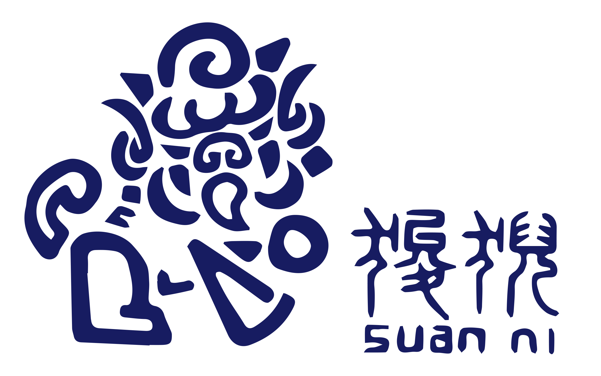

# REEF-script

These are the framework of paper **REEF: A Framework for Collecting Real-World Vulnerabilities and Fixes**

The chinese name of this framework is **狻猊** (suan ni), which is one of the security guard in traditional chinese tale. 

## overview

step1: mysele.py => results
step2: crawl.py => crawl_result
step3: crawl2raw.py => rawcode_result
step4: merge => merge_result

others:
LLM code

- llm